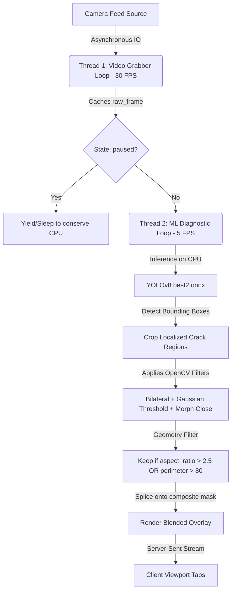

# Structural Health & Crack Diagnostics Hub

A high-performance, real-time computer vision and machine learning platform designed for inspection drone rigs, webcam systems, and static captures. The application detects and quantifies structural concrete crack defects dynamically, utilizing a dual-threaded Django + OpenCV pipeline coupled with custom YOLOv8 Nano deep learning weights.

---

## Key Features

* **Multi-Threaded Real-Time Video Grabber**: Runs dedicated camera grabber threads at 30 FPS to ensure lag-free video capture.
* **CPU-Optimized YOLOv8 ML Inference**: Evaluates structural anomalies on the CPU at a regulated 5 FPS rate to conserve host resources.
* **Separation of Concerns Viewport**: Designed as a Single-Page Application (SPA) with a dark glassmorphic styling, enabling seamless transitions between:
  1. **Live Feed View**: Real-time inspection streams supporting on-the-fly preview switches (Blended, Grayscale, Denoised, Thresholded, and Morphological Closing).
  2. **Still Analysis Studio**: A dedicated local diagnostics editor loaded with debounced parameter adjusters and a detailed severity analysis spreadsheet.
* **Local Image File Upload**: Supports uploading local JPEG/PNG concrete images directly through the dashboard, thread-safely pausing stream engines, caching BGR matrices in-memory, and immediately executing high-resolution crack inspections.
* **Edge-Preserving Parametric Filters**: Supports real-time adjustments of image contrast, brightness, Bilateral filtering, and Gaussian Adaptive thresholding parameters.
* **Automated Local Enhancement**: Features **CLAHE** (Contrast Limited Adaptive Histogram Equalization) on the Y (luminance) channel in the YCrCb color space to boost local concrete cracks in shadow matrices.
* **Decoupled Assets**: Fully decoupled inline stylesheets and script behaviors into external static resource files (`styles.css` and `diagnostics.js`).

---

## Logic Flow & How It Works

The platform operates on a decoupled multi-threaded backend architecture designed to maintain high stream rates while executing expensive deep-learning inferences:



### 1. Asynchronous Grabber Loop (Thread 1)
Continuously samples incoming hardware/network stream matrices via OpenCV's `VideoCapture.read()`. Frames are instantly loaded into memory to prevent queue delay. If paused, the thread yields to prevent continuous capture overhead.

### 2. Deep-Learning Detection Loop (Thread 2)
To save host computing cycles, the machine learning loop runs on a decoupled timer (5 FPS).
1. Grabs the latest cached frame, resizes it, and feeds it into the CPU-bound YOLO model.
2. For each detected crack bounding box (confidence threshold $\ge$ 0.25), it extracts the localized BGR crop.
3. Performs localized edge-preserving bilateral smoothing and Gaussian Adaptive Thresholding.
4. Filters out non-crack aggregate textures by validating geometric shape metrics (Min Area, Bounding Box Elongation, Contour Perimeter).
5. Splices the verified crack contours back onto the live canvas using a red binary mask.

### 3. Client SPA Navigation Swapper
The client-side `diagnostics.js` interacts asynchronously with Django's backend:
* When a still snap is requested, the system sends an AJAX trigger to pause camera grabbers, freezes inference loops, caches the high-res frame inside `captured_buffer`, and routes the client smoothly to the Analysis Studio.
* Parameter adjustments on sliders utilize a **350ms debouncer** to prevent concurrent request flooding.
* When returning, it fires a resume trigger to reactivate Thread 1 & 2 before switching tabs back to the live viewport.

---

## First-Time Setup & Installation

Follow these steps to initialize and launch the dashboard locally.

### Prerequisites
Make sure you have **Python 3.10+** and **pip** installed on your host system.

### Setup Instructions

1. **Clone the Repository** and navigate into the workspace:
   ```bash
   cd crack_dashboard
   ```

2. **Initialize a Virtual Environment**:
   ```bash
   python3 -m venv .venv
   ```

3. **Activate the Virtual Environment**:
   * **Linux/macOS**:
     ```bash
     source .venv/bin/activate
     ```
   * **Windows (cmd)**:
     ```cmd
     .venv\Scripts\activate.bat
     ```

4. **Install Dependencies**:
   ```bash
   pip install --upgrade pip
   ```
   ```bash
   pip install -r requirements.txt
   ```

5. **Perform Database Migrations** (initializes standard Django backend schemas):
   ```bash
   python manage.py migrate
   ```

---

## Running the Application

1. **Start the Django Development Server**:
   ```bash
   python manage.py runserver 0.0.0.0:8000
   ```
2. **Access the Dashboard**:
   Open your browser and navigate to: [http://localhost:8000/](http://localhost:8000/)

---

## Important Notes for First-Time Setup

> [!IMPORTANT]
> **System Camera Access**:
> The default video source is set to `/dev/video0` (index `0` in OpenCV). If you are running on a virtual machine or a system without a webcam, you may see a static placeholder or stream loading text. Use the **Active Video Source Target Selection** dropdown in the dashboard to connect a custom RTSP inspection feed or a network MJPEG stream.

> [!NOTE]
> **Host CPU Load**:
> Deep learning inference runs entirely on the host CPU. While paused inside the "Still Analysis Studio," all YOLO inference loops and background thread acquisitions are completely halted. This saves system resources and prevents thermal throttling during manual calibration.

> [!WARNING]
> **Browser Blockers**:
> If the live streams do not initialize, check that your browser is not blocking standard JPEG multipart streams (`multipart/x-mixed-replace`) which Django uses for live video streaming.
